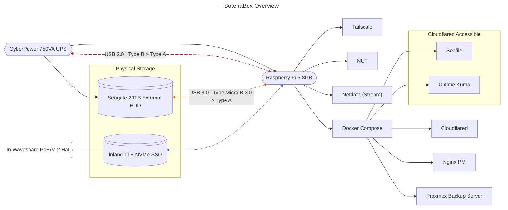

```mermaid
---
config:
  layout: dagre
title: SoteriaBox Overview
---
flowchart LR
 subgraph s1["Physical Storage"]
        n1["Seagate 20TB External HDD"]
        n2["Inland 1TB NVMe SSD"]
  end
 subgraph s2["Cloudflared Accessible"]
        n10["Seafile"]
        n13["Uptime Kuma"]
  end
    n4["CyberPower 750VA UPS"] --> n3(["Raspberry Pi 5 8GB"]) & n1
    n4 L_n4_n3_2@<-- "USB 2.0 | Type B &gt; Type A" --> n3
    n6["In Waveshare PoE/M.2 Hat"] --- n2
    n1 L_n1_n3_0@<-- "USB 3.0 | Type Micro B 3.0 &gt; Type A" --> n3
    n2 L_n2_n3_0@<--> n3
    n3 --> n8["Tailscale"] & n7["NUT"] & n14["Netdata (Stream)"] & n9["Docker Compose"]
    n9 --> n10 & n12["Cloudflared"] & n16["Nginx PM"] & n11["Proxmox Backup Server"] & n13

    n1@{ shape: disk}
    n2@{ shape: disk}
    n4@{ shape: hex}
    n6@{ shape: brace-r}
    style n6 stroke:#757575
    linkStyle 2 stroke:#D50000,fill:none
    linkStyle 3 stroke:#757575,fill:none
    linkStyle 4 stroke:#FF6D00,fill:none
    linkStyle 5 stroke:#2962FF,fill:none

    L_n4_n3_2@{ animation: slow } 
    L_n1_n3_0@{ animation: slow } 
    L_n2_n3_0@{ animation: fast }
```

# Notes
- Run Netdata in stream mode to save a surprising amount of resources. Disable ```[db]```, ```[web]```, and ```[health]``` in netdata.conf.
