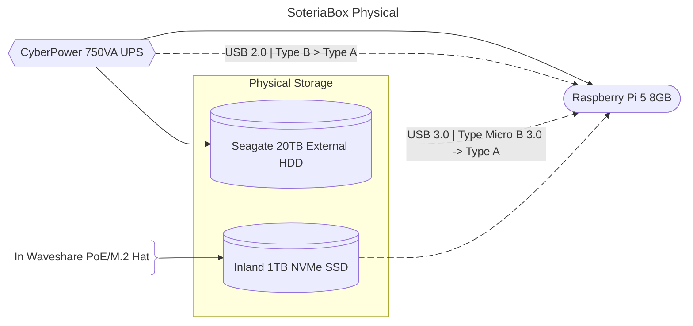

```mermaid
---
title: SoteriaBox Physical
---
flowchart LR
 subgraph s1["Physical Storage"]
        n1["Seagate 20TB External HDD"]
        n2["Inland 1TB NVMe SSD"]
  end
    n4["CyberPower 750VA UPS"] --> n3(["Raspberry Pi 5 8GB"]) & n1
    n4 L_n4_n3_2@-- "USB 2.0 | Type B &gt; Type A" --> n3
    n6["In Waveshare PoE/M.2 Hat"] --> n2
    n1 L_n1_n3_0@-- "USB 3.0 | Type Micro B 3.0 -&gt; Type A" --> n3
    n2 L_n2_n3_0@--> n3

    n1@{ shape: disk}
    n2@{ shape: disk}
    n4@{ shape: hex}
    n6@{ shape: brace-r}

    L_n4_n3_2@{ animation: slow } 
    L_n1_n3_0@{ animation: slow } 
    L_n2_n3_0@{ animation: fast }
```
